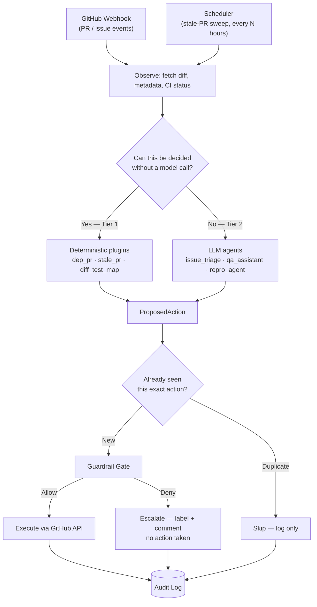
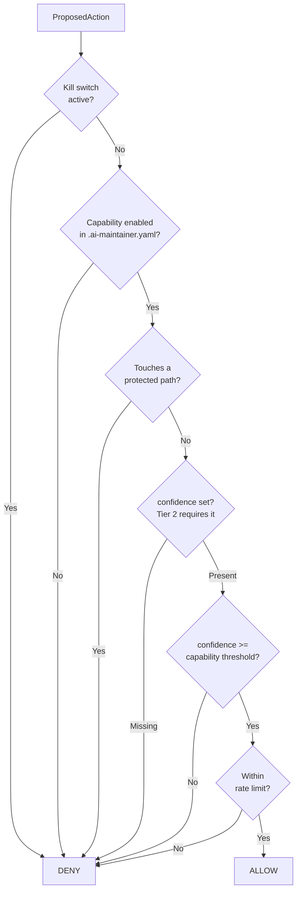
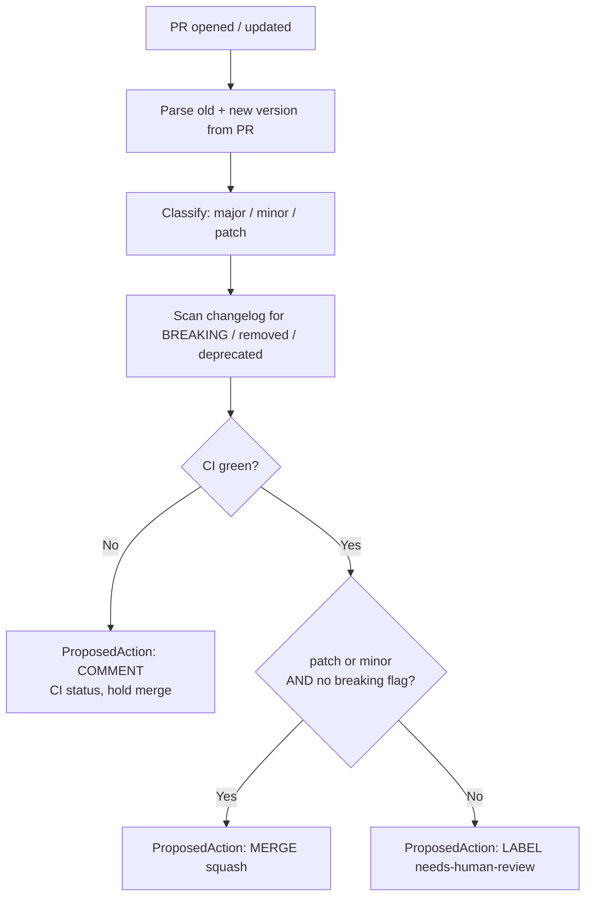
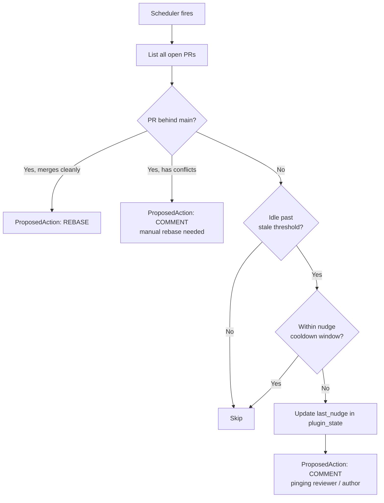
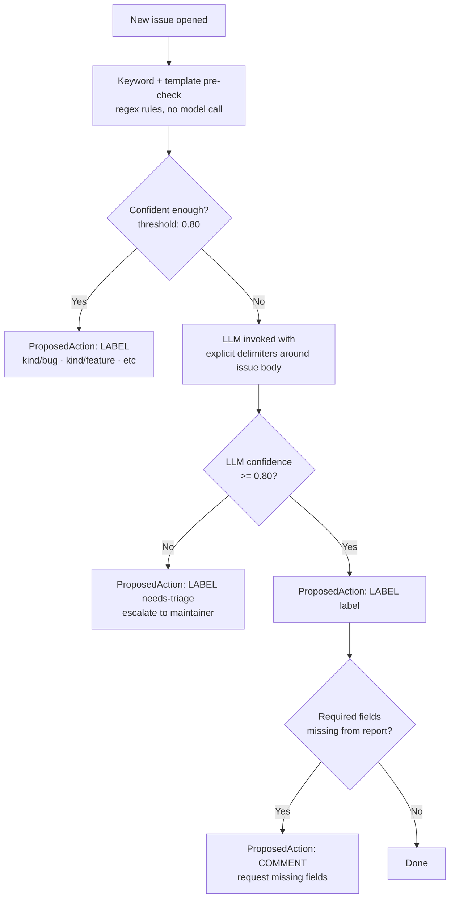
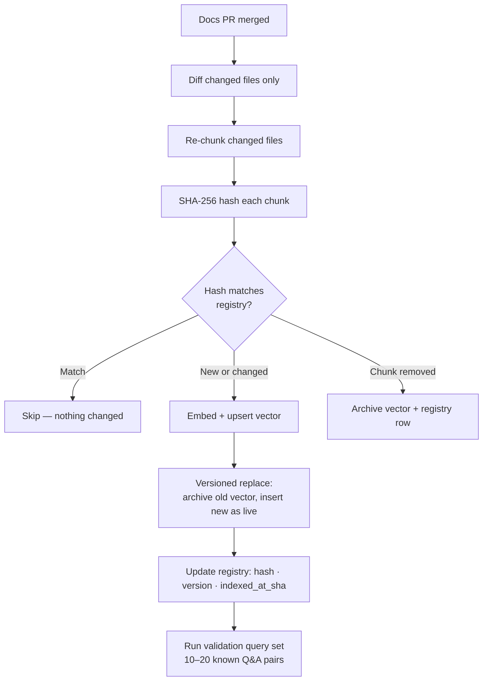
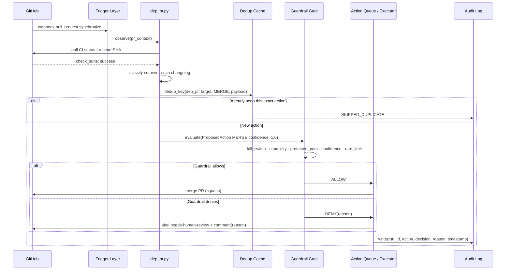
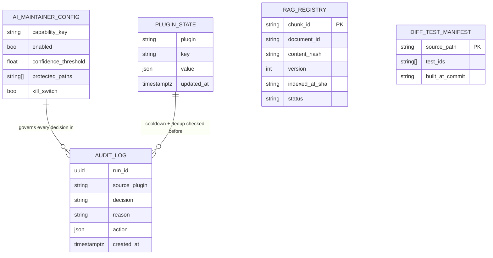

# Warden — AI Maintainer for Kyverno

Warden is a policy-enforcement system that automates low-judgment, high-volume maintainer work on the Kyverno repository. Every plugin produces a **proposal**, never a direct write. One guardrail gate decides. One audit log records every decision — allow or deny.

---

## What It Does

- Auto-merges Dependabot/Renovate PRs that are patch/minor bumps with green CI and no breaking-change signals
- Detects stale PRs and either rebases them automatically or nudges the author/reviewer
- Narrows CI scope to only the tests affected by a PR's diff — skipping the full suite when it isn't needed
- Triages new issues with a label and a request for missing fields when the bug template isn't complete
- (Stretch) Answers repeated Kyverno questions via a RAG pipeline over the docs
- (Stretch) Attempts to reproduce bugs from a policy + resource YAML in a throwaway sandbox

---

## Project Structure

```
warden/
├── .ai-maintainer.yaml        # capability toggles, thresholds, kill switch, protected paths
├── core/
│   ├── actions.py             # ProposedAction contract shared by every plugin
│   ├── config.py              # .ai-maintainer.yaml loader — fails startup on bad config
│   ├── executor.py            # dedup → gate → execute → audit (the only I/O shell)
│   ├── guardrail.py           # pure evaluate_action() — zero I/O, fully unit-testable
│   ├── plugins.py             # Tier1Plugin + Tier2Agent protocols, TriggerEvent
│   └── tests/
│       └── test_guardrail.py  # 100% branch coverage on evaluate_action() required before Phase 1
├── plugins/
│   ├── dep_pr.py              # Tier 1 — dependency PR triage
│   ├── stale_pr.py            # Tier 1 — stale PR detection + nudge cooldown
│   ├── diff_test_map.py       # Tier 1 — diff-to-test scoping
│   └── issue_triage.py        # Tier 2 — issue classification (LLM fallback)
└── rag/
    └── registry.py            # RAG metadata registry — content-hash change detection
```

---

## Architecture

### How a GitHub event becomes an action

Every event — a webhook from GitHub or a scheduler tick — passes through the same pipeline regardless of which plugin handles it.



Tier 1 and Tier 2 are separated by **determinism**, not importance. Semver classification, stale-PR age, and path-to-test mapping have no ambiguity — no model call needed, pure computation, testable with unit tests. Issue classification requires judgment — the LLM is a fallback only after cheap keyword rules fail.

---

### Guardrail gate — the only security-critical function

`evaluate_action()` in `core/guardrail.py` is a pure function: `(ProposedAction, Config) → Decision`. Zero I/O. Every branch is unit-tested before any plugin ships.

Order matters — cheap absolute checks short-circuit before expensive ones are evaluated.



**Fail-closed rule:** a Tier 2 agent that forgets to set `confidence` gets `DENY`, never `ALLOW`. A bug in a prompt template causes "escalates too much" — not "merges too much."

---

### Plugin data flows

#### dep_pr.py — Dependency PR triage (Tier 1)

Classifies a Dependabot/Renovate PR and decides auto-merge vs. escalate. No model call.



No persistent state — each PR is evaluated fresh from its own metadata on every event.

---

#### stale_pr.py — Stale PR detection (Tier 1)

Runs on a scheduler. Finds PRs that have fallen behind `main` or gone quiet.



Cooldown state is stored in the generic `plugin_state` table — prevents re-nudging the same PR on every scheduler tick.

---

#### diff_test_map.py — Diff-to-test scoping (Tier 1)

Maps changed files to the subset of tests that actually need to run. Uses a JSON manifest checked into the repo.

```mermaid
flowchart TD
    A[PR opened / updated] --> B[Get changed file paths from diff]
    B --> C{Any file matches\nbroad-blast-radius pattern?\ngo.mod · Makefile · generated code}
    C -->|Yes| D[ProposedAction: CI_TRIGGER scope=full]
    C -->|No| E{All paths present\nin manifest?}
    E -->|Unmapped path found| D
    E -->|All mapped| F[Union of test IDs for changed files]
    F --> G[ProposedAction: CI_TRIGGER scope=test_ids]
```



This plugin's token physically cannot call MERGE, LABEL, or COMMENT — narrowing CI scope is its only action.

---

#### issue_triage.py — Issue triage (Tier 2)

Keyword/template pre-check first. LLM is only invoked when the pre-check is not confident enough.



Issue body is always injected with explicit XML-style delimiters — never string-concatenated into the instruction portion of the prompt. The agent's token is credential-scoped to LABEL + COMMENT only; it is physically incapable of calling MERGE or CLOSE_ISSUE.

---

#### rag/registry.py — RAG metadata registry (Stretch)

Tracks what has been indexed so only changed doc chunks are re-embedded, not the entire corpus.



Only one `live` row per `document_id` in the production collection — superseded versions are archived immediately, never left queryable alongside the new version.

---

### Full sequence: Dependabot PR auto-merge



---

### Data stores



`PLUGIN_STATE` is one generic table — it covers stale-PR nudge cooldown, dedup cache entries, and any future plugin state without a new schema per plugin. `RAG_REGISTRY` and `DIFF_TEST_MANIFEST` stay separate because their query patterns and lifecycles genuinely differ.

---

## Core Contract

Every plugin and agent — Tier 1 or Tier 2 — emits the same `ProposedAction` shape:

```python
ProposedAction(
    source_plugin   = "dep_pr",
    target          = Target(repo="kyverno/kyverno", pr_number=42),
    action_type     = ActionType.MERGE,
    payload         = {"merge_method": "squash"},
    rationale       = "patch bump, CI green, no breaking signals",
    requires_capability = "dep_pr.auto_merge",
    confidence      = 1.0,   # Tier 1: 1.0 / Tier 2: REQUIRED, 0–1
)
```

The guardrail gate never needs to know which plugin produced the proposal — only the shape matters.

---

## Configuration

All capability toggles live in `.ai-maintainer.yaml`. Changes require a PR with maintainer review — this file is listed in its own `protected_paths`.

```yaml
kill_switch: false   # flip to true to halt all autonomous actions immediately

capabilities:
  dep_pr:
    auto_merge:
      enabled: true
      confidence_threshold: 1.0
  issue_triage:
    label:
      enabled: true
      confidence_threshold: 0.80   # Tier 2 — LLM output

protected_paths:
  - ".ai-maintainer.yaml"   # the config protects itself
  - "config/crds/**"
  - ".github/workflows/**"
```

---

## Running the Tests

```bash
pip install pytest
pytest core/tests/
```

`evaluate_action()` ships with 100% branch coverage. Phase 1 (live execution) does not start until this gate passes in CI.

---

## Implementation Phases

| Phase | Scope | Exit criteria |
|---|---|---|
| 0 | Core contracts · guardrail · config · stores | `evaluate_action` 100% branch coverage in CI |
| 1 | `dep_pr` + `stale_pr` (shadow mode first) | 2 weeks shadow with zero false positives before flipping live |
| 2 | `diff_test_map` | Scoped runs match full-suite pass/fail on historical PRs |
| 3 | `issue_triage` + eval harness | Precision/recall per label class checked into CI |
| 4 (stretch) | `repro_agent` + `qa_assistant` / RAG | Validation query set passes post-ingestion; confidence threshold tuned on real Slack Q&A |

---

## Safety Properties

- **Kill switch** — one config flag halts all autonomous actions globally, immediately
- **Fail-closed confidence** — a Tier 2 agent that omits `confidence` gets `DENY`, never `ALLOW`
- **Credential-scoped tokens** — each agent's GitHub App token is scoped to only the action types it is allowed to emit, enforced at the credential layer not just config
- **Prompt injection defence** — all untrusted input (issue bodies, PR descriptions, doc chunks) is injected into prompts with explicit delimiters, never string-concatenated into instructions
- **Dedup cache** — redelivered webhooks and overlapping scheduler ticks collapse to one action, preventing double-merges or double-nudges
- **Audit log** — every proposal and every gate decision (allow or deny) is written before any action executes; a denial is as much a decision worth recording as an approval
